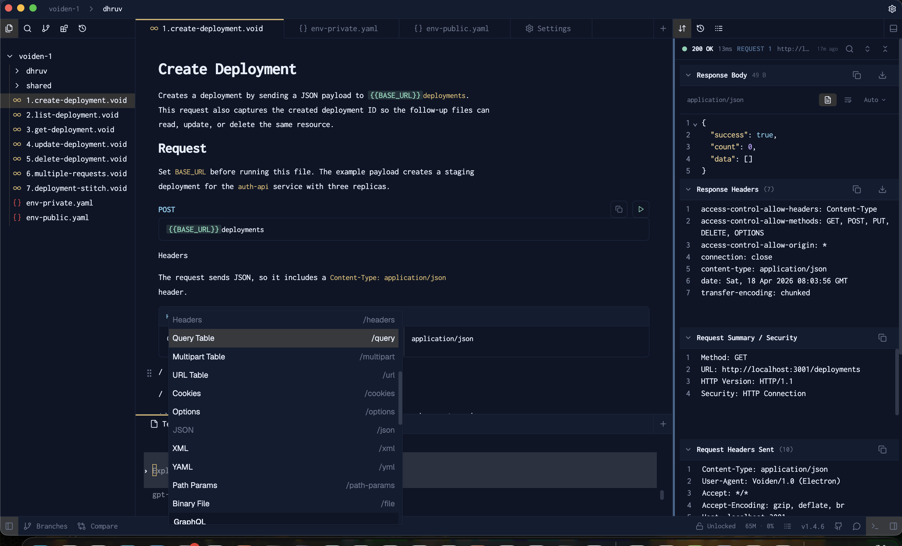

  

<p align="center">
  <a href="https://voiden.md">
    
  </a>
</p>

<h1 align="center">Voiden : The offline, Git-native API workspace.</h1>

<p align="center">
  Build, test, document, and collaborate on APIs with plain-text <code>.void</code> files.
</p>

<p align="center">
  No accounts. No required cloud sync. Just local files, reusable blocks, and Git.
</p>

<p align="center">
  <a href="https://voiden.md/download">
    
  </a>
  <a href="https://docs.voiden.md/docs/getting-started-section/intro">
    
  </a>
  <a href="https://voiden.md/changelog">
    
  </a>
  <a href="https://voiden.md/blog">
    
  </a>
</p>

<p align="center">
  <a href="https://discord.com/invite/XSYCf7JF4F">
    
  </a>
  <a href="https://x.com/VoidenMD">
    
  </a>
  <a href="https://www.linkedin.com/showcase/voiden/">
    
  </a>
</p>

<p align="center">
  <a href="LICENSE">
    
  </a>
  <a href="https://github.com/VoidenHQ/voiden/releases">
    
  </a>
</p>



## Why Voiden

Voiden is for developers, testers, and technical writers who want API work to feel like code instead of a SaaS dashboard.

- Keep requests, notes, and reusable API building blocks (endpoint, auth, params, body) in the same `.void` files.
- Work in Markdown and structured blocks instead of opaque collections locked inside an app.
- Reuse headers, auth, bodies, and whole sections across files with linked blocks and linked files.
- Test and document APIs without leaving the editor.
- Collaborate with Git branches and pull requests instead of proprietary team workspaces.
- Stay local-first with no signup and no required cloud sync.

## Install

**Current version:** `1.4.6`

Download installers for macOS, Windows, and Linux from [voiden.md/download](https://voiden.md/download).
Direct downloads are available for Apple Silicon and Intel macOS, Windows `.exe`, and Linux `.deb`, `.rpm`, and `.AppImage` builds.

### Package managers


| Platform | Stable                              | Early access                        |
| -------- | ----------------------------------- | ----------------------------------- |
| macOS    | `brew install voiden`               | `brew install voiden@beta`          |
| Windows  | `winget` and Chocolatey coming soon | `winget` and Chocolatey coming soon |
| Linux    | `apt` and `snap` support            | Beta `apt` and `snap` channels      |


Homebrew

```bash
brew install voiden
# beta
brew install voiden@beta
```


APT (Ubuntu / Debian)

```bash
curl -fsSL https://voiden.md/apt/stable/voiden.gpg | sudo gpg --dearmor -o /etc/apt/keyrings/voiden.gpg
echo "deb [arch=amd64 signed-by=/etc/apt/keyrings/voiden.gpg] https://voiden.md/apt/stable stable main" | sudo tee /etc/apt/sources.list.d/voiden.list
sudo apt update && sudo apt install voiden
```

```bash
# beta
curl -fsSL https://voiden.md/apt/beta/voiden.gpg | sudo gpg --dearmor -o /etc/apt/keyrings/voiden-beta.gpg
echo "deb [arch=amd64 signed-by=/etc/apt/keyrings/voiden-beta.gpg] https://voiden.md/apt/beta beta main" | sudo tee /etc/apt/sources.list.d/voiden-beta.list
sudo apt update && sudo apt install voiden
```


Snap

```bash
sudo snap install voiden
# beta
sudo snap install voiden --channel=beta
```


Looking for newer builds? Check the early access section on [voiden.md/download](https://voiden.md/download).

## Get started with Voiden

1. Install Voiden and open it. No signup or login is required.
2. Create a `.void` file in any folder and add your request, docs, and reusable blocks.
3. Run the request with `Cmd+Enter` or `Ctrl+Enter`, then commit the file to Git.

For a guided first run, see the [Voiden quick start](https://docs.voiden.md/docs/getting-started-section/getting-started/quick-start).

### Coming from Postman

If you already use Postman, you can bring your existing collections with you:

1. In Postman, export your collection as JSON (v2.1 is recommended).
2. Drag the exported JSON file into the Voiden file list on the left panel.
3. Open the imported file and click **Generate Voiden Files** to create a folder of native `.void` files — one per request, with headers, auth, query params, path variables, bodies, and response examples preserved.

Full walkthrough: [Postman Imports](https://docs.voiden.md/docs/getting-started-section/getting-started/postman-import). OpenAPI specs work the same way via [OpenAPI Imports](https://docs.voiden.md/docs/getting-started-section/getting-started/openapi-imports).

## What you can do

- Build REST and HTTP requests with headers, query params, JSON/XML/YAML/form bodies, file uploads, and cURL import/export.
- Work with GraphQL using schema import, a visual query builder, variables, and subscriptions.
- Use WebSocket and gRPC workflows in the same workspace.
- Add pre-request and post-response scripts in JavaScript, Python, or shell.
- Run assertions and stitch multiple `.void` files into batch runs with aggregated results.
- Import OpenAPI specs and Postman  collections into native Voiden files.
- Keep Git, terminal, docs, and API testing close together inside the desktop app.

## What a `.void` file looks like

Voiden files combine frontmatter, Markdown, and structured `void` request blocks so the request and the documentation live together.

**Document frontmatter:**

```yaml
---
version: 1.4.6
generatedBy: Voiden app
generatedAt: 2026-04-16T10:24:00.000Z
---
```

**Markdown body:**

```markdown
# Hello, World

A simple GET request you can run with Cmd/Ctrl+Enter.
```

**A `void` request block:**

```yaml
---
type: request
content:
  - type: method
    content: GET
  - type: url
    content: https://echo.apyhub.com
---
```

Voiden generates the document metadata and block IDs for you inside the app.

## Documentation

### User docs

- [Getting started](https://docs.voiden.md/docs/getting-started-section/intro)
- [Download](https://voiden.md/download)
- [Changelog](https://voiden.md/changelog)
- [Blog](https://voiden.md/blog)

### Contributor docs


| Topic                                                    | Description                                  |
| -------------------------------------------------------- | -------------------------------------------- |
| [Fresh install](docs/getting-started/FRESH_INSTALL.md)   | Repository setup and local development       |
| [Architecture overview](docs/architecture/OVERVIEW.md)   | Core app, extension system, and request flow |
| [Extension guide](docs/extensions/HOW_TO_ADD.md)         | Build your own extension                     |
| [Themes](docs/customization/THEMES.md)                   | Create custom themes                         |
| [Troubleshooting](docs/troubleshooting/COMMON_ISSUES.md) | Common issues and fixes                      |


See the [documentation index](docs/INDEX.md) for the full list.

## Build from Source

For platform-specific prerequisites and troubleshooting, start with [Fresh Install](docs/getting-started/FRESH_INSTALL.md).

```bash
git clone https://github.com/VoidenHQ/voiden.git
cd voiden
corepack enable
yarn set version 4.3.1
yarn install
yarn workspace @voiden/core-extensions build
cd apps/electron && yarn start
```

If you hit Windows build issues, see [Build Errors](docs/troubleshooting/BUILD_ERRORS.md).

## Project Structure

```text
voiden/
├── apps/
│   ├── electron/          # Electron main process
│   └── ui/                # React renderer
├── core-extensions/       # Built-in extensions
└── docs/                  # Documentation
```

## Why Electron?

Voiden is built on [Electron](https://www.electronjs.org/). We are building something closer to an IDE for APIs than a lightweight request sender, so we wanted a mature, cross-platform foundation that ships consistently on macOS, Windows, and Linux, gives us deep system access for things like Git and the terminal, and lets us keep a rich, custom editor experience.

We also know Electron gets a bad reputation, often inherited from other API tools. Our take is that footprint matters, but stability, reliability, and cross-platform predictability matter more when users feel them every day. We would rather be transparent about resource usage and keep optimizing it than chase a lighter stack that breaks in subtle ways.

Read the full reasoning here: [Why Voiden is Built on Electron?](https://docs.voiden.md/docs/getting-started-section/getting-started/why-electron).

## Community

- Report bugs and request features in [GitHub Issues](https://github.com/VoidenHQ/voiden/issues).
- Join the [Voiden Discord](https://discord.com/invite/XSYCf7JF4F) for updates and office hours.
- Track upcoming work in [GitHub Milestones](https://github.com/VoidenHQ/voiden/milestones).

## Contributing

We welcome contributions. Start with:

- [Contributing Guide](CONTRIBUTING.md)
- [Code of Conduct](CODE_OF_CONDUCT.md)
- [Security Policy](SECURITY.md)

## License

This project is licensed under the [Apache License 2.0](LICENSE).
